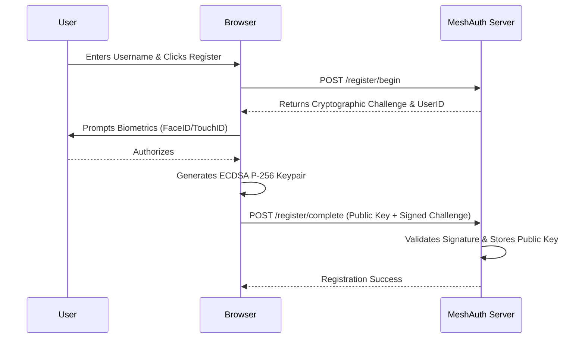
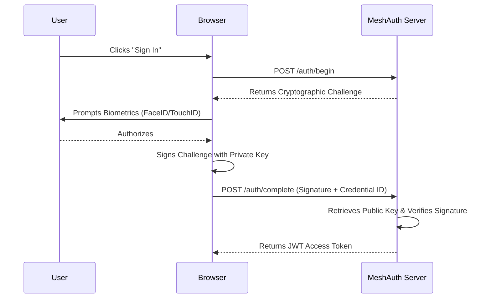

# MeshAuth

<div align="center">
  <h3>Zero-Cost, Passwordless Authentication Infrastructure</h3>
  <p>Replace Auth0, Okta, and Firebase Auth with standard WebAuthn/FIDO2. Stop paying per-user for authentication.</p>
</div>

---

## 🛑 Why Passwords are Obsolete

The era of passwords is over. Passwords are inherently flawed:
1. **Security Vulnerabilities:** Over 80% of data breaches are caused by weak, reused, or stolen passwords. Phishing remains the #1 attack vector globally.
2. **Poor User Experience:** Users hate creating, remembering, and resetting passwords. Password resets cost organizations an average of $70 per request in support overhead.
3. **The "Shared Secret" Problem:** Passwords require both the user and the server to know (or hash) the same secret. If a server is breached, the hashes are stolen, eventually cracked, and reused across other services.

### Enter Passkeys and WebAuthn

MeshAuth leverages **WebAuthn (Web Authentication)** and **FIDO2**, standardizing public-key cryptography for the web. Instead of shared secrets, MeshAuth uses a **Challenge-Response** mechanism:
- A unique keypair is generated for your service.
- The **Public Key** is stored on your server.
- The **Private Key** remains securely enclaved in the user's authenticator (e.g., Face ID, Touch ID, Windows Hello, YubiKey).
- The Private Key NEVER leaves the device. Phishing becomes mathematically impossible because there is no secret to steal or intercept.

## 🌟 What is MeshAuth?

MeshAuth is an open-source, passwordless authentication library and server suite that provides end-to-end passkey infrastructure. It allows you to drop-in passwordless authentication into any web application in minutes, completely replacing expensive enterprise identity providers like Auth0, Okta, Clerk, or Stytch.

### Key Features
- **$0 per MAU:** Self-hosted or statically deployed, you pay nothing per user.
- **Biometric Ready:** Out-of-the-box support for FaceID, TouchID, Android Fingerprint, and Windows Hello.
- **Cross-Platform:** Support for hardware security keys (YubiKey, Google Titan).
- **Phishing-Proof:** Enforces origin-bound keys (anti-phishing).
- **Anti-Replay:** Challenge-response implementation protects against replay attacks.
- **Zero Dependencies:** Ultra-lightweight core (under 5kb gzipped).

---

## ⚔️ Comparison: MeshAuth vs. Competitors

| Feature | MeshAuth | Auth0 | Okta | Clerk | Firebase Auth | Supertokens |
|---------|----------|-------|------|-------|---------------|-------------|
| **Cost for 100k MAUs** | **$0** | ~$1,000/mo | Enterprise | ~$2,000/mo | Variable | Variable |
| **Authentication Model** | Passkey-First | Password-First | Password-First| Password/OTP | Password/OTP | Password-First |
| **Phishing Resistance** | 100% (WebAuthn) | Optional MFA | Optional MFA | Optional | Optional | Optional |
| **Data Ownership** | **Yours** | Vendor | Vendor | Vendor | Google | Self/Vendor |
| **Vendor Lock-in** | **None** | High | High | High | High | Medium |
| **Setup Time** | < 10 mins | Days | Weeks | Minutes | Minutes | Minutes |

---

## 🏗️ Authentication Flow Architecture

MeshAuth uses a secure, two-step process for both registration and authentication.

### 1. Registration Flow


### 2. Authentication Flow


---

## 🛡️ Security Model

MeshAuth is built on a robust security foundation adhering to FIDO2 standards:

1. **ECDSA P-256:** Uses Elliptic Curve Digital Signature Algorithm (P-256 curve) for strong, fast cryptography.
2. **Anti-Replay via Challenge-Response:** Every transaction involves a securely generated random challenge (`crypto.getRandomValues`) that must be signed. Reusing a previous signature will fail.
3. **Origin Binding:** WebAuthn ties the credential to the specific domain (Relying Party ID). A passkey created for `yourdomain.com` cannot be phished by `evil-domain.com`.
4. **No Shared Secrets:** Servers only store public keys, rendering database breaches useless to attackers.

---

## 📦 Installation & Setup

### 1. Install Client SDK

```bash
npm install meshauth
```

### 2. Go Server Setup (Optional but recommended)

MeshAuth provides a lightweight Go backend out of the box.

```bash
cd server
go run main.go auth.go store.go types.go
```
The server will run on `http://localhost:8080`.

---

## 🚀 Usage Examples

### Initialization

```typescript
import { MeshAuth } from 'meshauth';

const auth = new MeshAuth({
  rpName: "My Awesome App",
  rpId: window.location.hostname, // Must match your domain
  serverUrl: "https://api.yourdomain.com", // Optional: Custom backend
});
```

### 1. Checking WebAuthn Support

Before attempting passkey flows, ensure the device supports them.

```typescript
if (MeshAuth.isSupported()) {
  console.log("Device supports Passkeys!");
} else {
  console.warn("Passkeys are not supported on this device/browser.");
  // Fallback to Magic Links if necessary
}
```

### 2. Registering a New User (Sign Up)

```typescript
async function signUp(username: string, fullName: string) {
  try {
    const credential = await auth.register(username, fullName);
    console.log("Successfully registered! Credential ID:", credential.id);
    
    // Redirect to dashboard
    window.location.href = '/dashboard';
  } catch (error) {
    console.error("Registration failed:", error.message);
  }
}

// Usage
signUp("user@example.com", "John Doe");
```

### 3. Authenticating an Existing User (Sign In)

```typescript
async function signIn(username?: string) {
  try {
    // If username is omitted, the browser will prompt for discoverable credentials (Passkeys)
    const result = await auth.authenticate(username);
    
    if (result.success) {
      console.log("Signed in successfully! Token:", result.token);
      // Store token, redirect to dashboard
    } else {
      console.error("Authentication failed:", result.error);
    }
  } catch (error) {
    console.error("Unexpected error during sign in:", error);
  }
}

// Usage
signIn("user@example.com");
```

### 4. Managing Multiple Devices

MeshAuth allows users to register multiple devices (e.g., iPhone, MacBook, Windows PC) to the same account.

```typescript
async function listDevices() {
  const devices = await auth.getCredentials();
  devices.forEach(device => {
    console.log(`Device registered on: ${new Date(device.createdAt)}`);
  });
}

async function removeDevice(credentialId: string) {
  await auth.removeCredential(credentialId);
  console.log("Device revoked.");
}
```

---

## 📚 API Reference

### `MeshAuth` Class

#### `constructor(options: MeshAuthOptions)`
Initializes the MeshAuth client.
- **`options.rpName`** *(string)*: Display name of your application.
- **`options.rpId`** *(string)*: Domain of your application (e.g., `example.com`).
- **`options.serverUrl`** *(string, optional)*: URL of your backend.

#### `async register(username: string, displayName: string): Promise<Credential>`
Initiates the WebAuthn registration flow. Prompts the user for biometric approval and creates a new Passkey.

#### `async authenticate(username?: string): Promise<AuthResult>`
Initiates the WebAuthn authentication flow.
- Returns `{ success: true, token: string }` on success.
- Returns `{ success: false, error: string }` on failure.

#### `static isSupported(): boolean`
Returns `true` if the browser supports WebAuthn (`window.PublicKeyCredential` exists).

#### `async getCredentials(): Promise<StoredCredential[]>`
Returns an array of locally cached credentials for the user.

#### `async removeCredential(credentialId: string): Promise<void>`
Deletes a stored credential from local cache. (Note: Should also revoke on the server).

---

## 📡 Go Server API Endpoints

The included Go server (`server/`) implements the following endpoints to handle the cryptographic heavy lifting:

### `POST /register/begin`
- **Request:** `{ "username": "user@example.com" }`
- **Response:** `{ "challenge": "base64url...", "userID": "base64url..." }`
- **Action:** Generates a random cryptographic challenge.

### `POST /register/complete`
- **Request:** `{ "username": "user@example.com", "credID": "...", "pubKey": "..." }`
- **Response:** `200 OK`
- **Action:** Verifies the WebAuthn attestation object and securely stores the Public Key for future logins.

### `POST /auth/begin`
- **Request:** `{ "username": "user@example.com" }`
- **Response:** `{ "challenge": "base64url..." }`
- **Action:** Generates a random cryptographic challenge for authentication.

### `POST /auth/complete`
- **Request:** `{ "username": "user@example.com", "credID": "...", "signature": "..." }`
- **Response:** `{ "token": "jwt..." }`
- **Action:** Verifies the signature against the stored Public Key. If valid, issues an authentication token.

---

## 🌐 Deployment Guide

### Client Side
The client SDK can be bundled with any modern tool (Webpack, Vite, Rollup) and works in React, Vue, Svelte, or Vanilla JS.

### Server Side (Go)
1. Build the binary: `go build -o meshauth-server ./server/...`
2. Set environment variables (e.g., `PORT`, `DB_DSN`).
3. Deploy behind a reverse proxy (Nginx, Caddy) or deploy directly to AWS ECS, Heroku, or Render.
4. **CRITICAL:** WebAuthn requires **HTTPS** to function. It will silently fail on HTTP (except for `localhost` during development).

---

## ❓ FAQ

**Q: What happens if a user loses their device?**
A: With Passkeys (especially synced passkeys like Apple iCloud Keychain or Google Password Manager), the key is automatically backed up and synced to new devices. If using hardware keys, users should register multiple keys (a primary and a backup).

**Q: Do I still need an email for the user?**
A: WebAuthn doesn't strictly require an email; it just needs a unique identifier. However, collecting an email is often useful for communication or fallback access methods.

**Q: Are passkeys cross-platform?**
A: Yes! Modern devices support cross-platform authentication (e.g., using an iPhone to sign into a Windows PC via QR code).

---

## ⚖️ License — Business Source License 1.1

> **Source-available, NOT open-source. All production use requires a paid license.**
> Replaces: Auth0, Okta, Clerk

| Tier | Price | For |
|:-----|:------|:----|
| **Indie** | $249/year | Solo developer, <$100K revenue |
| **Startup** | $1,999/year | Up to 10-25 devs, <$5M revenue |
| **Enterprise** | $9,999/year | Unlimited seats, unlimited revenue |
| **OEM / White-Label** | $19,999/year | Embed in your product |
| **Full IP Buyout** | $750,000 | Complete ownership transfer |

**Free use limited to:** Personal evaluation, academic research, contributing via PRs.

📧 [soumyadebnath1661@gmail.com](mailto:soumyadebnath1661@gmail.com) · 📞 [+91 7031648617](tel:+917031648617) · 🐙 [github.com/itsoumya-d](https://github.com/itsoumya-d)

© 2024-2026 Soumya Debnath. All Rights Reserved.
